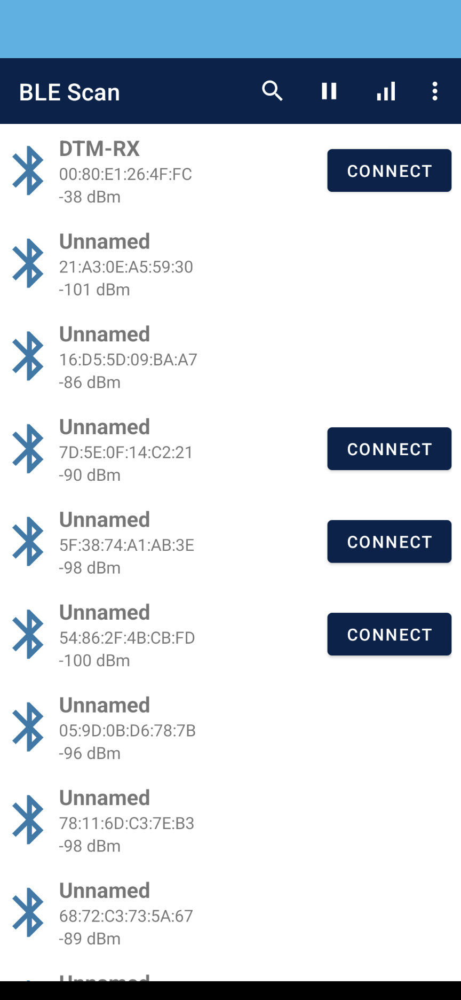
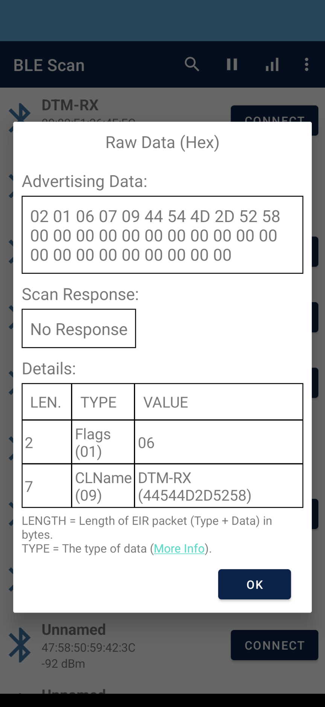
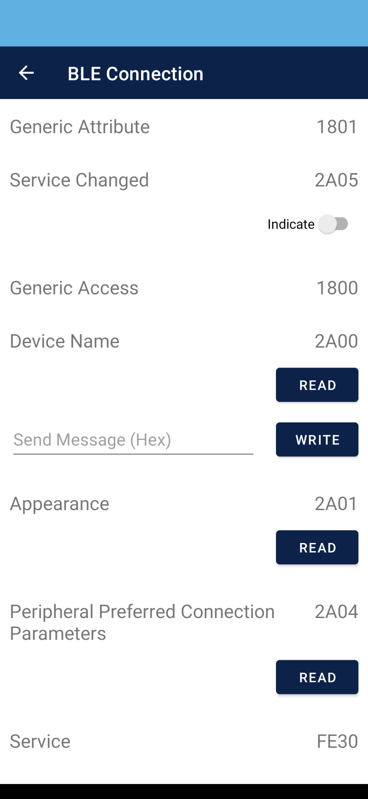
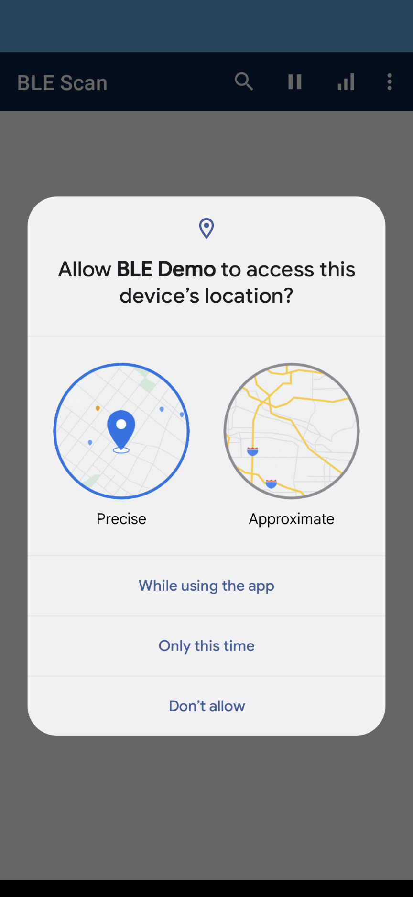

# BLE Demo

   
   
   

The BLE Demo is an application created in Android Studio by ST Microelectronics for mobile devices running Android. The app is split into two parts: scanning & connection. In the scanning phase, the user can scan for nearby Bluetooth devices, filter scanning by device name or RSSI value, and read a device's raw & parsed advertising data. Once connected to the BLE device, the user will see a list of the device's BLE services & characteristics. The user can then use the read, write, & notify functionality on each supported characteristic.

## Application Details

* App Name: BLE Demo
* App Version: 1.0.3
* Package: com.stm.bledemo

- Minimum Android SDK: 24 (Android 7)
- Target Android SDK: 31 (Android 12)

* 100% Kotlin

- Tested on the Following Devices:
    * Samsung Galaxy Tab A7 Lite
    * Google Pixel 5

## Permissions

* BLUETOOTH
* BLUETOOTH_ADMIN
* ACCESS_FINE_LOCATION
* ACCESS_COARSE_LOCATION
* BLUETOOTH_CONNECT
* BLUETOOTH_SCAN

## Dependencies

* Core-KTX
* AppCompat
* Material
* ConstraintLayout
* RecyclerView
* Anko
* Junit
* Espresso
* [Timber](https://github.com/JakeWharton/timber)

## Download
Go to [Utilities/APK](Utilities/APK) to download the APK file.

## User Guide
1. Download the APK and install it on a mobile device running the minimum supported Android version.
    * You may need to change a setting that allows the installation of "unknown apps" to install the APK.

   

2. Open the application and you will be prompted with some permission requests. These permissions are necessary for Bluetooth functionality, tap approve on each request.

   

3. Once permissions are granted, a list of scanned nearby Bluetooth devices will be populated.
    * Tap the pause / play icon on the toolbar to toggle Bluetooth scanning.
4. There are two methods of filtering the scan list: filter by device name or filter by RSSI value.
    * Tap the search icon on the toolbar and start typing the device name to filter the list to devices matching your search.
    * Tap the signal icon on the toolbar and drag the slider to filter results to devices with an RSSI value lower than the slider's value.

   

5. Tap on a scanned device in the list to view its raw and parsed advertising data.
6. Tap on the connect button on a scanned device in the list to attempt a Bluetooth connection to the device.
    * If no connect button is present, it means the device is not currently connectable.

   

7. On succesful connection, a list of the device's Bluetooth services and characteristics will be populated.
    * If it is a known service or characteristic, its name will be listed.
8. On each characteristic a read button, write button, and/or notify/indicate switch will be shown if it has the functionality.
    * Use the read button to read the characteristic's current value.
    * Type a hexadecimal message and tap the write button to write a message to the characteristic.
    * Toggle the notify/indicate switch to subscribe or unsubscribe to changes to the characteristic's value.

## Troubleshooting

**Caution** : Issues and pull-requests are **not supported** to submit problems or suggestions related to the software delivered in this repository. The BLE Demo example is being delivered as-is, and not necessarily supported by ST.

**For any other question** related to the product, the hardware performance or characteristics, the tools, the environment, you can submit it to the [ST Community](https://community.st.com).
